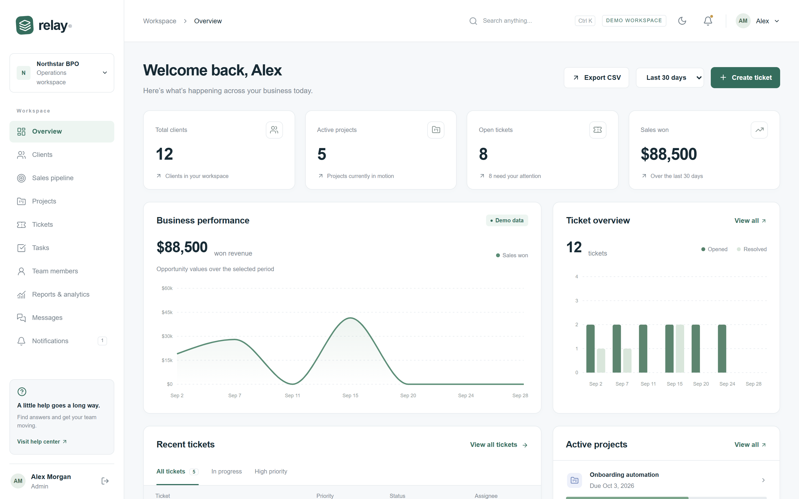
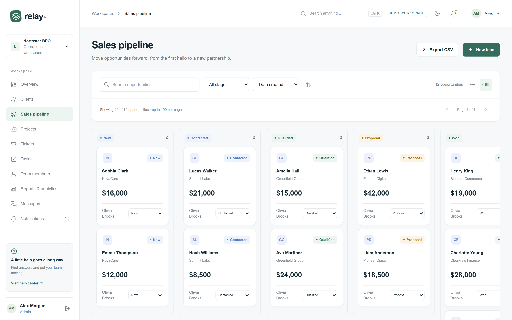
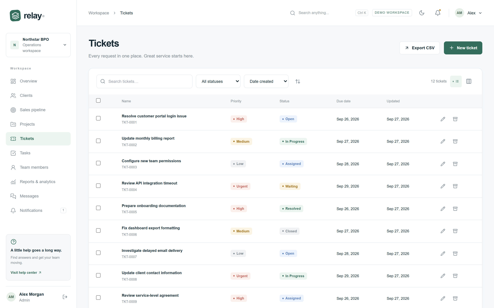
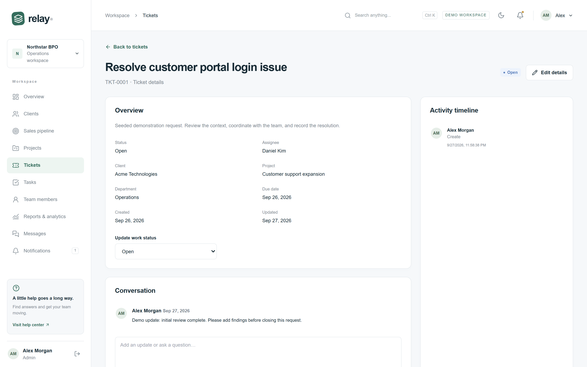
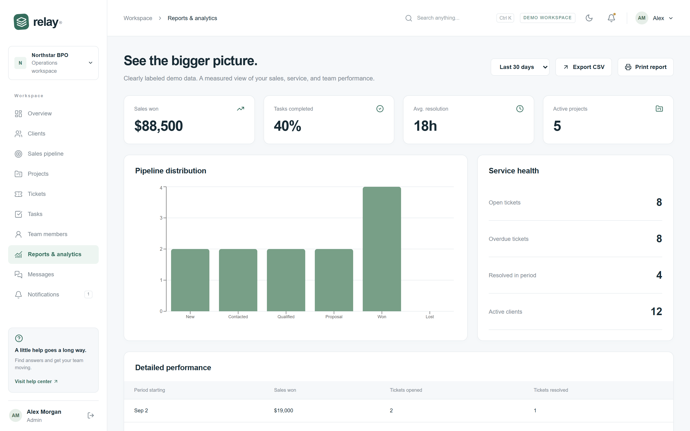
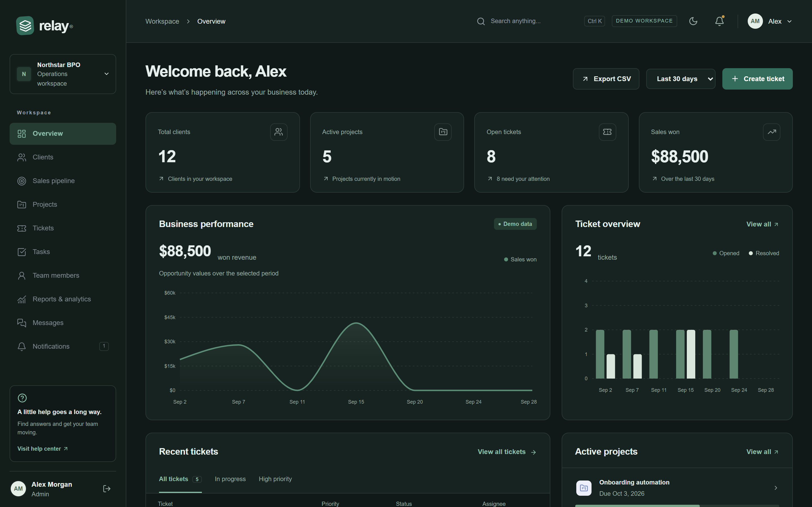
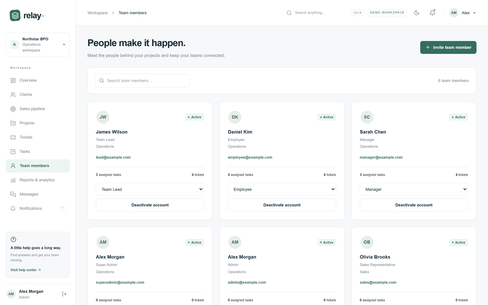
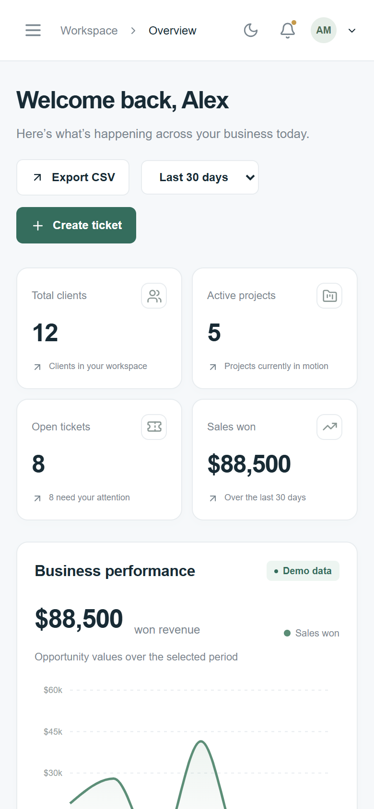

# Relay — operations workspace for BPO teams

Relay brings a service company's clients, sales pipeline, projects, tasks, support tickets and team into one workspace, with each role seeing only what it needs.

**[▶ Live demo](https://relay-teal-seven.vercel.app)** · one click to sign in as an Admin, Manager, Sales rep or Employee, no sign-up needed.



---

## Live demo

> **Live URL:** https://relay-teal-seven.vercel.app
>
> Runs on free plans (Vercel and Neon). After a quiet spell the first request can take a few seconds while the database wakes up.

On the sign-in page, choose a role under **"or explore the live demo as"**:

| Role         | What they can do                                                        |
| ------------ | ----------------------------------------------------------------------- |
| **Admin**    | Everything: clients, sales, projects, tickets, team, analytics, billing |
| **Manager**  | Clients, projects, tasks and tickets for their department               |
| **Sales**    | Clients and the sales pipeline                                          |
| **Employee** | Only the tasks and tickets assigned to them                             |

All data is fictional and shared between visitors. Account settings are read-only in the demo, so it stays usable for the next person.

## Features

**Operations**

- Dashboard with live totals, sales and ticket charts, recent activity and upcoming deadlines (7, 30 or 90 days)
- Clients, leads, projects, tasks and tickets, each with search, filters, sorting, pagination and CSV export
- Kanban-style sales pipeline; moving a deal to _Won_ records when it was won
- Record pages with comments, subtasks, time tracking, project members and file attachments (PNG, JPEG and PDF, checked by file contents)
- Global search with **Ctrl K**

**Team and collaboration**

- Six roles (Super Admin, Admin, Manager, Team Lead, Sales, Employee), with access enforced on the server for every request
- Invite-only registration, team and department management
- Direct messages and real-time notifications over WebSockets (on serverless hosting such as Vercel, the client polls every 15 seconds instead)
- Audit log of sign-ins and every change

**Product polish**

- Light and dark themes, responsive down to phone width
- Loading, empty, error, 403, 404, offline and maintenance states
- Draft legal pages (privacy, terms, cookies, DPA, accessibility and more) plus cookie preferences

|                                                      |                                              |
| ---------------------------------------------------- | -------------------------------------------- |
|      |      |
|  |  |
|     |            |

<p align="center"></p>

## Tech stack

| Layer                | Technology                                                           |
| -------------------- | -------------------------------------------------------------------- |
| Framework            | Next.js 15 (App Router), React 19, TypeScript                        |
| UI                   | Tailwind CSS, Radix UI primitives, Recharts, Lucide icons            |
| Forms and validation | React Hook Form, Zod (shared between client and server)              |
| Data                 | PostgreSQL, Prisma ORM with versioned migrations                     |
| Auth                 | NextAuth (JWT sessions checked against the database on each request) |
| Real time            | Socket.IO on a custom Node server                                    |
| Testing              | Vitest (unit and database integration), Playwright (end to end)      |
| Delivery             | Docker (multi-stage image), Docker Compose                           |

## Security and data isolation

- **Multi-tenant:** every query is scoped to the signed-in user's company, and integration tests check that one company can't read another's records.
- **Role-based access:** one permission table in [`src/lib/permissions.ts`](src/lib/permissions.ts) drives both the API and the UI.
- **Sessions:** changing or resetting a password, or deactivating a user, ends their sessions everywhere, including open WebSocket connections.
- **Tokens:** reset and invite links are random, stored only as SHA-256 hashes, expire after one hour and work once.
- **Abuse limits:** sign-in is limited per account (failed attempts only) and per IP address; writes, invites and resets are limited too.
- **Requests:** origin checks on every change, a Content Security Policy, HSTS and other security headers, and upload size and file-type checks.
- **Audit trail:** each change and its audit entry are written in the same database transaction.

## Run it locally

Requires **Node.js 22+**. You don't need to install PostgreSQL: an embedded database runs from `npm`.

```bash
npm install
cp .env.example .env          # then set NEXTAUTH_SECRET to a random value
npm run db:local              # terminal 1: starts PostgreSQL on 127.0.0.1:5432
npm run db:migrate            # terminal 2: create tables
npm run db:seed               # load the demo company
npm run dev                   # http://localhost:3000
```

Prefer Docker? `docker compose up -d db mail` starts PostgreSQL and a local mail catcher (Mailpit, at http://localhost:8025), and `docker compose --profile app up --build` runs the whole app.

### Environment variables

| Variable              | Purpose                                                                  |
| --------------------- | ------------------------------------------------------------------------ |
| `DATABASE_URL`        | PostgreSQL connection string                                             |
| `NEXTAUTH_URL`        | Public URL of the app                                                    |
| `NEXTAUTH_SECRET`     | Random secret for signing sessions (`openssl rand -base64 32`)           |
| `SMTP_*`, `MAIL_FROM` | Email for invites and password resets                                    |
| `DEMO_MODE`           | `true` shows one-click demo sign-in and makes account settings read-only |
| `DEMO_PASSWORD`       | Password the seed gives demo accounts                                    |

### Scripts

| Command                       | What it does                                |
| ----------------------------- | ------------------------------------------- |
| `npm run dev`                 | Start the app with live reload              |
| `npm run build` / `npm start` | Production build and server                 |
| `npm run typecheck`           | TypeScript check                            |
| `npm test`                    | Unit tests                                  |
| `npm run test:integration`    | Database tests (needs the database running) |
| `npm run test:e2e`            | Playwright browser tests                    |
| `npm run format`              | Format the code with Prettier               |

## Tests

| Suite       | Count | Covers                                                                                                                                   |
| ----------- | ----- | ---------------------------------------------------------------------------------------------------------------------------------------- |
| Unit        | 8     | Role permissions, input validation                                                                                                       |
| Integration | 8     | Real PostgreSQL: persistence, company isolation, employee access limits, audit trail, dashboard totals                                   |
| End to end  | 8     | All roles signing in, CRUD through the UI, ticket and lead workflows, forged-request rejection, single-use password reset, mobile layout |

All 24 pass.

## Free deployment

The live demo runs on free plans with no credit card: **Vercel** (Hobby) for the app and **Neon** for PostgreSQL.

1. Create a Neon project and copy its **direct** connection string (connection pooling off).
2. On Vercel, import this repository and add the environment variables `DATABASE_URL` (the Neon string), `NEXTAUTH_SECRET` (a long random string) and `DEMO_MODE=true`, then deploy. The app detects its own public URL.
3. In GitHub, add the same Neon string as the repository secret `DATABASE_URL` and run **Actions → Reset demo data** once. That creates the tables and loads the demo company.

The workflow ([`.github/workflows/reset-demo.yml`](.github/workflows/reset-demo.yml)) also resets the demo to fresh data every day at 03:00 UTC. It refuses to run against a database that holds any non-demo company.

On Vercel, live updates use polling, and file uploads are disabled in demo mode because serverless functions have no persistent disk. To keep WebSockets and uploads, run the Docker image on any container host instead ([`render.yaml`](render.yaml) is included for Render).

## Project structure

```
prisma/              schema, migrations, demo seed
server.ts            custom Node server: Next.js plus Socket.IO
src/app/             routes: (auth) pages, (workspace) pages, api/ handlers, policies
src/components/      UI: dashboard, records, record detail, settings, shell
src/lib/             server logic: auth, permissions, records, dashboard, security, rate limits
tests/               unit, integration and Playwright end-to-end tests
```

## Project status

- **Billing:** the upgrade, downgrade and cancel screens are built, but no payment provider is connected and no payments are taken.
- **Legal pages:** drafts that need review before real use.
- [`ARCHITECTURE.md`](ARCHITECTURE.md) has the design notes and the full scope checklist.

## Author

Built by **[Your Name](https://www.upwork.com/freelancers/your-profile)**. Available for full-stack Next.js and TypeScript projects on Upwork.
